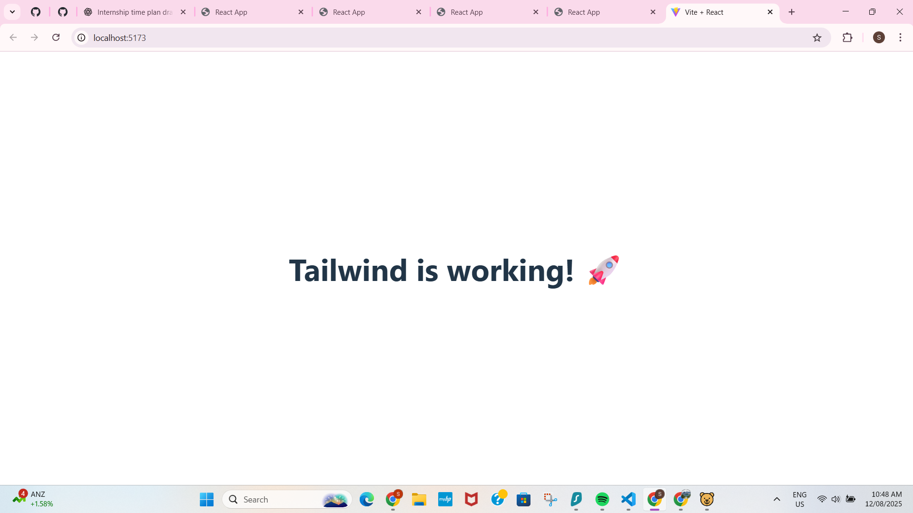

# ssethx24-intern-repo-focusbear
This is Shaurya Seth's public repo as a focus bear intern. 

7️⃣ README.md for GitHub (Tailwind Setup)

# React + Tailwind CSS Setup

## Steps I Followed
1. **Created React project with Vite**
   npm create vite@latest my-tailwind-app --template react
   cd my-tailwind-app
   npm install
Installed Tailwind CSS

npm install -D tailwindcss postcss autoprefixer
npx tailwindcss init -p
Configured Tailwind (tailwind.config.js)

js

export default {
  content: [
    "./index.html",
    "./src/**/*.{js,ts,jsx,tsx}"
  ],
  theme: { extend: {} },
  plugins: [],
}
Added Tailwind directives in src/index.css:

css

@tailwind base;
@tailwind components;
@tailwind utilities;
Tested Tailwind by adding classes in App.jsx.

Ran project:
npm run dev
Verification
Styled heading appeared with Tailwind styles applied.

No CSS errors in console.

Screenshot verifying the setup

Tailwind is working!!