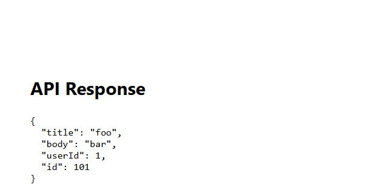

### Reflection

**Why is it useful to create a reusable Axios instance?**  
A reusable Axios instance centralizes configuration (base URLs, headers, timeouts), making code cleaner, consistent, and easier to maintain. Updates to settings can be made in one place and instantly applied to all requests.  

**How does intercepting requests help with authentication?**  
Request interceptors automatically attach authentication tokens to every outgoing request, removing the need to manually include them each time. This reduces mistakes and keeps the code DRY.  

**What happens if an API request times out, and how can you handle it?**  
If a request times out, Axios throws an error. You can handle this by catching the error and showing a friendly message or retrying the request. Timeouts protect the UI from hanging when servers are slow or unresponsive.  

---

### Practical Evidence  

**a) Axios Instance Setup – `my-react-app\src\api\axiosInstance.js`**  
Screenshots showing:  
- **Base URL** – `https://jsonplaceholder.typicode.com`  
- **Default headers** – `Accept`, `Content-Type`, `X-Request-ID`  
- **Timeout** – `10000` ms  
- **Request interceptor** – adds Bearer token and regenerates `X-Request-ID`  
- **Response interceptor** – logs responses and handles errors  
- **AbortController** – `getAbortController()` helper  

  
  
  
  
  
  

---

**b) POST Request Result – `image-30.png`**  
Screenshot of the running React app showing the API response from the POST request:  
  
{
  "title": "foo",
  "body": "bar",
  "userId": 1,
  "id": 101
}
