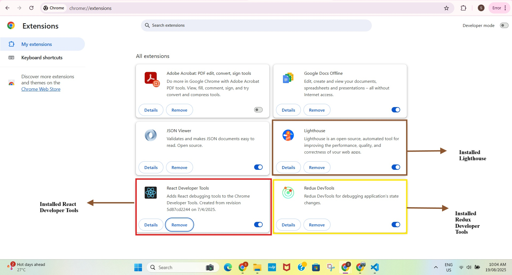

# Chrome Extensions for Dev Productivity

## Which extensions did you install and why?

1. **React Developer Tools**  
   Helps me inspect the structure of React components in the DOM and see their current props and state. Makes debugging React apps easier.

2. **Redux DevTools**  
   Lets me view and track state changes in Redux apps, including action history and time-travel debugging.

3. **JSON Viewer**  
   Pretty-prints raw JSON responses in the browser. This is very helpful when working with REST APIs.

4. **Lighthouse**  
   A tool for auditing web performance, accessibility, and best practices. Helps me understand how my app performs and where I can improve.

## What was the most useful thing you learned?

I found it really useful that **React Developer Tools** not only shows the component tree, but also lets me view the current state and props of each component. This is going to be extremely helpful when debugging complex component behavior.

**Lighthouse** was also eye-opening — it shows performance scores and suggests optimizations I wouldn’t have thought of on my own. This is my first time using it. 
 
 

 Screenshot confirming installation of the chrome extensions. 