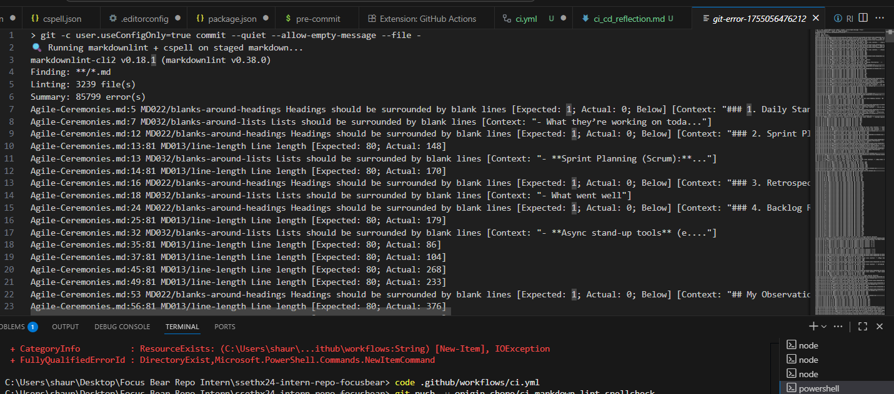

# CI/CD Reflection

## What is the purpose of CI/CD?
**Continuous Integration (CI)** automatically builds and tests every change in a clean environment, catching issues early and keeping the main branch always releasable. **Continuous Deployment/Delivery (CD)** automates the path from a green build to a release, reducing manual steps and human error. Together, CI/CD shortens feedback loops, increases confidence in changes, and makes releases repeatable and predictable.

## How does automating style checks improve project quality?
Automated checks (e.g., Markdown linting and spell checking) enforce consistent formatting and catch typos before review. That:
- Keeps docs readable and searchable,
- Reduces nitpicky PR comments so reviewers focus on substance,
- Prevents “style drift” across contributors,
- Makes onboarding easier because the rules are encoded, not tribal knowledge.

## What are some challenges with enforcing checks in CI/CD?
- **False positives / dictionary management:** Proper nouns or product names can fail spell checks; the dictionary must be curated over time.
- **Developer friction:** Overly strict rules can feel heavy; rules should match the project’s tolerance and be easy to fix.
- **Config sprawl:** Multiple tools/config files can confuse contributors; documentation and templates help.
- **Environment parity:** Differences between local and CI Node/tooling versions can produce inconsistent results; pinning versions and using lockfiles helps.
- **Performance:** Big repos or many checks can slow feedback; caching and targeted paths mitigate this.

## How do CI/CD pipelines differ between small projects and large teams?
- **Small projects:** One or two fast jobs (lint + tests), minimal gates, quick iteration. Simplicity and speed matter most.
- **Large teams:** Multi-stage pipelines (lint → unit/integration tests → build → security/scanning → deploy), branch protection rules, required reviews, environment promotion, and audit/compliance steps. More gates mean higher confidence but longer runtimes; caching/matrices and clear ownership keep them maintainable.

---

### Key takeaways
- Encode quality rules as code; let bots enforce them consistently.
- Keep checks fast and actionable; failures should explain *what* and *how to fix*.
- Start simple, then evolve the pipeline as the team and risk surface grow.

Evidence:

During testing, the Husky pre-commit hook successfully blocked my commit because the staged Markdown files did not pass linting and spellcheck rules. As shown in the screenshot, markdownlint reported multiple violations such as missing blank lines around headings (MD022), blank lines around lists (MD032), and exceeding the maximum line length (MD013). This confirms that the pre-commit hook is enforcing formatting and quality standards before allowing commits, which is an important safeguard in the CI/CD pipeline.

2f1ef5f839b6cf3fc6832c07ec33f8eaab94e10c Commit ID