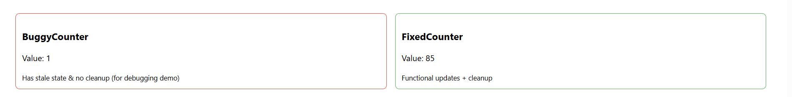

# Debugging Practice – BuggyCounter Example

**Commit ID:** b04462af9be0494781f753248a89dc2a13a314c4  
**Files in `my-react-app` modified/created:**
- `src/bugs/BuggyCounter.jsx`
- `src/fixed/FixedCounter.jsx`
- `src/App.js`

---

## 1. What was the issue?
The `BuggyCounter` component had **two major problems**:  

1. **Stale state updates** – The counter value inside `setInterval` was using an outdated snapshot of `count`, which caused unexpected increments.  
2. **No cleanup** – The interval kept running even after the component unmounted, leading to potential memory leaks and unintended behavior.

---

## 2. What debugging method did you use?
- Added **`console.log(count)`** inside the interval to track counter updates in real-time.  
- Watched the **browser console output** for unexpected patterns.  
- Checked **React’s ESLint warnings** for missing dependencies in `useEffect`.  
- Compared the behavior between manual increments and automatic increments from the interval.

---

## 3. How did you resolve the problem?
- Updated state changes to use **functional updates**:
  ```javascript
  setCount(c => c + 1);
 

 

 Desc of ss
 
 
Left Box – BuggyCounter (Red Border)
Value: 1

This counter is stuck at a very low value because it’s using stale state inside a setInterval and doesn’t clean up when unmounted.

The red border is intentional to indicate it’s the broken version.

Text: “Has stale state & no cleanup (for debugging demo)”

This is your label to show that this component is intentionally buggy so you can observe the problem.

Right Box – FixedCounter (Green Border)
Value: 85

This counter has been running correctly because you fixed the logic:

Uses functional state updates (setCount(c => c + 1)) to avoid stale values.

Cleans up the interval with a return () => clearInterval(id) in useEffect.

The green border signals it’s the working version.

Text: “Functional updates + cleanup”

This is your note showing the fix strategy.

💡 Purpose of the screenshot:
It visually demonstrates before and after debugging — one component showing incorrect behavior (BuggyCounter), and the other showing the correct fix (FixedCounter). This is exactly what your debugging_practice.md reflection describes.