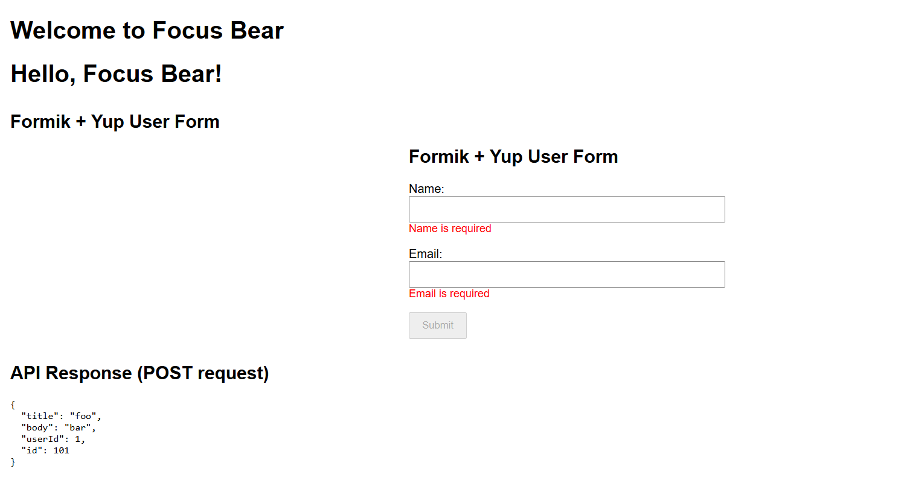
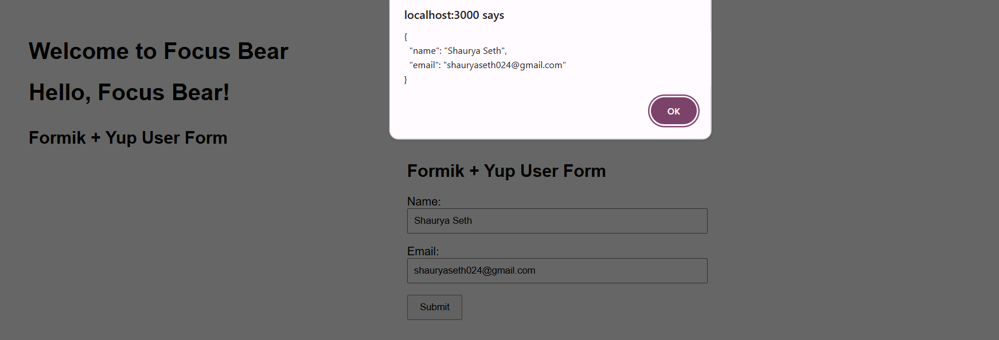

## Form Handling Reflection

### What is Formik and why is it useful?

Formik is a popular open-source library for building and managing forms in React. It abstracts away the repetitive and error-prone parts of form handling like managing form state, validation, submission, and error messages. It simplifies form-related tasks by using controlled components internally and handling changes with minimal boilerplate.

Formik is particularly useful because:
- It integrates seamlessly with validation libraries like **Yup**
- Reduces the need for manual `useState` for each field
- Helps manage `touched`, `errors`, and `dirty` state out of the box
- Keeps forms declarative and clean
- Works well with both simple and complex forms

---

### How does Formik simplify form management compared to handling state manually?

Without Formik, you'd need to:
- Declare `useState` for each field
- Track whether fields are touched
- Write your own validation logic for each field
- Display and clear errors manually
- Handle `onChange`, `onBlur`, and `onSubmit` for each field

Formik wraps all of this into a single `useFormik` hook (or `<Formik>` component), managing it behind the scenes. This greatly reduces boilerplate and keeps the form logic concise and readable.

---

### What are the benefits of using Formik’s validation instead of writing validation logic manually?

Formik integrates with **Yup**, a schema-based validation library. This allows you to:
- Define all validation rules in one place
- Get automatic error messages
- Easily reuse validation schemas
- Avoid writing if-else checks and manual regex checks
- Keep the form logic clean and declarative

Manual validation would require a lot of repetitive code and constant refactoring as forms grow in complexity. Formik + Yup makes validation scalable and less error-prone.

---

### Screenshots

✅ **This is my form created using Formik. The Submit button is disabled until the form is valid and changed:**

✅ **On pressing Submit, the form data is shown in an alert:**

