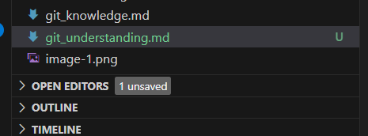

# Understanding Git: Staging vs Committing (In Simple Words)

## What’s the difference between staging and committing?

When you're using Git, you don't save your work all at once. First, you **stage** your changes — this means you’re picking which changes you want to include. Then, you **commit** those changes — this means you’re saving them permanently in your project’s history with a message like “Fixed bug” or “Updated the header.”

Think of it like packing a lunch:
- **Staging** is choosing what food to put in the lunchbox.
- **Committing** is closing the lunchbox and saying, “This is today’s lunch.”

---

## Why does Git make you do both steps?

Git separates staging and committing so you can:
- Choose exactly what we want to save (maybe you don’t want to save *everything* you changed).
- Group changes into logical pieces — like one commit for a bug fix, another for a new feature.
- Take your time to review what’s ready before we save it forever.

---

## When would you stage something but not commit it yet?

Here are a few examples:
- You fixed three things but only want to commit one for now — we can stage just that one.
- We're working on a big change and want to get part of it ready to commit later.
- We’re showing a teammate what’s staged, but you’re not done writing the commit message yet.
-We want to double-check your work before saving it.

---

Thus,  Staging is your prep step, and committing is the save step.

Staged file- The green U next to the file name means "Untracked", but now added (staged).

In Git (especially in VS Code), this green color and the U indicator show that Git sees this file as new, and we have staged it using the VS Code interface).