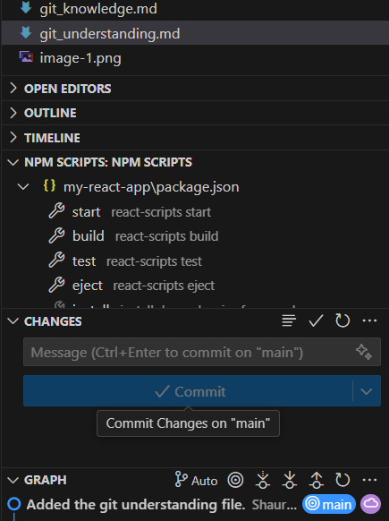

# Understanding Git: Staging vs Committing (In Simple Words)

## What’s the difference between staging and committing?

When you're using Git, you don't save your work all at once. First, you **stage** your changes — this means you’re picking which changes you want to include. Then, you **commit** those changes — this means you’re saving them permanently in your project’s history with a message like “Fixed bug” or “Updated the header.”

Think of it like packing a lunch:
- **Staging** is choosing what food to put in the lunchbox.
- **Committing** is closing the lunchbox and saying, “This is today’s lunch.”

---

## Why does Git make you do both steps?

Git separates staging and committing so you can:
- Choose exactly what we want to save (maybe you don’t want to save *everything* you changed).
- Group changes into logical pieces — like one commit for a bug fix, another for a new feature.
- Take your time to review what’s ready before we save it forever.

---

## When would you stage something but not commit it yet?

Here are a few examples:
- You fixed three things but only want to commit one for now — we can stage just that one.
- We're working on a big change and want to get part of it ready to commit later.
- We’re showing a teammate what’s staged, but you’re not done writing the commit message yet.
-We want to double-check your work before saving it.

---

Thus,  Staging is your prep step, and committing is the save step.
Staging screenshot

Staged file- The green U next to the file name means "Untracked", but now added (staged).

In Git (especially in VS Code), this green color and the U indicator show that Git sees this file as new, and we have staged it using the VS Code interface).

Committing Screenshot


At the bottom in the GRAPH section in the amove image , it shows:

Added the git understanding file. Shaurya
That means your commit went through successfully.

The blue dot on main and the message next to it indicate that this commit is now part of the local branch (main).


# Understanding Merge Conflicts in Git

## What Caused the Conflict?

Merge conflicts in Git occur when changes made in different branches overlap in the same part of a file and Git cannot automatically decide which version to keep.

In my case, I created a merge conflict in a file called `sample.txt`:

- In the `feature-branch`, I edited the file to say:
Hello from the feature branch!

css
Copy code

- In the `main` branch, I edited the same line to:
Hello from the main branch!

yaml
Copy code

When I attempted to merge `feature-branch` into `main`, Git was unable to determine which line to use because both branches modified the same line differently. This caused a **merge conflict**.

---

## How Did I Resolve It?

I used GitHub Desktop to resolve the conflict.

1. After attempting the merge, GitHub Desktop alerted me to a merge conflict in `sample.txt`.
2. I opened the conflicted file. It showed conflict markers like this:

 ```plaintext
 <<<<<<< HEAD
 Hello from the main branch!
 =======
 Hello from the feature branch!
 >>>>>>> feature-branch
I manually edited the file to combine both lines into a single message:

plaintext
Copy code
Hello from both branches!
Then I saved the file, marked the conflict as resolved in GitHub Desktop, and committed the merge.

Finally, I pushed the changes to GitHub using the desktop client.

What Did I Learn?
Merge conflicts occur when two branches make changes to the same line or closely positioned lines in a file.

Git can usually handle merges automatically, but in conflicting cases, human input is needed to resolve ambiguity.

GUI tools like GitHub Desktop make it easy to identify and resolve conflicts visually.

It’s best to resolve conflicts by carefully reviewing changes and combining them logically where needed.

Regularly pulling changes and communicating with collaborators can help minimize the frequency of conflicts.

Successfully created, resolved, and learned from a merge conflict!

---

## Why teams use branches instead of pushing directly to main

### Why is pushing directly to main problematic?
Pushing directly to `main` can lead to unstable or broken code if someone makes a mistake. It can also overwrite others’ work or make debugging harder. That’s why teams prefer to use separate branches for new features or bug fixes.

### How do branches help with reviewing code?
Branches let developers work on their changes separately. When they’re done, they can create a pull request or merge request. This lets others **review the code**, suggest changes, and ensure nothing breaks before it gets added to `main`.

### What happens if two people edit the same file on different branches?
Git will try to merge both changes. If they edit **different lines**, Git handles it automatically. But if they edit the **same lines**, a **merge conflict** happens. Developers will need to manually resolve it and choose which version to keep in the repository.

# Exploring Useful Git Commands

In this section, I experimented with four important Git commands: `git checkout`, `git cherry-pick`, `git log`, and `git blame`. These are particularly useful in larger projects involving multiple developers and long-running branches.

---

## 1. `git checkout main -- <file>`

### ✅ What It Does:
This command **restores a specific file** from the `main` branch into your current working branch, without affecting any other files or changes.

### 🧪 What I Did:
I made a change in a file on a feature branch but then decided to discard those changes and use the version from `main`. I ran:

```bash
git checkout main -- sample.txt
It successfully replaced only sample.txt with the version from main while keeping my other edits intact.

📌 When to Use It:
To undo changes to a single file without resetting the whole working directory.

To selectively pull a clean version of a file from another branch.

💡 What Surprised Me:
It’s non-destructive and doesn’t require stashing or committing other changes — very handy in active development.

2. git cherry-pick <commit>
✅ What It Does:
This command applies a single commit (or multiple specific commits) from another branch onto your current branch — without merging the full branch.

🧪 What I Did:
In my feature branch, I made multiple commits. I then switched to main and picked one of those commits using:

bash
Copy code
git cherry-pick <commit-hash>
Only that commit was applied to main, leaving out the rest of the branch’s changes.

📌 When to Use It:
To bring a bug fix or feature into another branch (like main or production) without merging unrelated work.

For backporting fixes across versions.

💡 What Surprised Me:
Git even preserves the original commit message. It felt like copying-and-pasting just one piece of work into a new timeline.

3. git log
✅ What It Does:
Displays the commit history, including author, timestamp, and message for each commit. It helps track the evolution of the repository.

🧪 What I Did:
I ran the basic command:

bash
Copy code
git log
Then tried enhancements:

bash
Copy code
git log --oneline --graph --all
Which gave me a visual representation of branches and merges.

📌 When to Use It:
To trace how a project has changed over time.

To find commit hashes for cherry-picking or reverting.

To debug when something was introduced.

💡 What Surprised Me:
The visual graph made it easy to understand branching. It’s much clearer than I expected — and helped me track merges and diverging work.

4. git blame <file>
✅ What It Does:
Shows who last modified each line of a file and in which commit. Useful for tracking the origin of code.

🧪 What I Did:
I ran:

bash
Copy code
git blame sample.txt
This showed each line with commit hash, author, and date — very helpful for understanding file history.

📌 When to Use It:
To investigate who introduced a bug or a specific logic line.

During code reviews when you need context or want to follow up with a contributor.

💡 What Surprised Me:
You can even narrow it down by line numbers:

bash
Copy code
git blame -L 5,15 sample.txt
This is great for large files — I didn't know this level of precision was available.

🧠 Final Reflections
Each of these commands gives you surgical control over your Git repository:

git checkout helps restore files without disturbing the rest.

git cherry-pick is perfect for selectively applying work.

git log is your time machine.

git blame is like Git detective mode.

These tools are essential for collaborative projects where you need to move fast without losing control. I’ll be using them a lot more going forward!

# Using `git bisect` for Debugging

In this section, I explored the `git bisect` command, which is a powerful tool for debugging. It helps identify the exact commit that introduced a bug by using a binary search through the project's commit history.

---

## 🔍 What Does `git bisect` Do?

`git bisect` performs a **binary search** over the commit history to find the exact commit that introduced a bug. You tell Git:

- A **"good"** commit where things were working,
- A **"bad"** commit where the bug exists.

Git then checks out a midpoint commit between those two, and asks you to test it. Based on your feedback (`good` or `bad`), Git continues the search until it narrows down the faulty commit.

This is incredibly useful when the bug was introduced somewhere in a long series of commits, and it's hard to eyeball the exact one manually.

---

## 🧪 Test Scenario

### 1. **Set up commits**

I created a file `math.js` and made the following commits:

- ✅ Commit 1: Initial function returning `2 + 2`
- ✅ Commit 2: Changed to `add(2, 2)` with correct implementation
- ✅ Commit 3: Refactored add to a separate file
- ❌ Commit 4: Accidentally changed `+` to `-`, introducing a bug
- ✅ Commit 5: Added unrelated style change

Now, calling `add(2, 2)` returns `0`, but I wasn’t sure which commit caused this.

### 2. **Using `git bisect`**

I ran the following in the CLI:

```bash
git bisect start
git bisect bad        # current commit has the bug
git bisect good <commit-hash-of-working-version>
Git automatically checked out a middle commit. I tested the add function and reported it as good or bad with:

bash
git bisect good   # if the bug is not present
git bisect bad    # if the bug is present
After 2–3 steps, Git returned:

sql
<commit-hash> is the first bad commit
That was the commit where I mistakenly changed + to -.

3. Ending the bisect session
bash
git bisect reset
This returned me to the original HEAD.

🛠 When Would You Use This?
When a bug is discovered but you're not sure when it was introduced.

In large projects with dozens or hundreds of commits between releases.

To avoid manually reading diffs and commit messages one by one.

It is especially helpful when tests or behaviors are easy to check manually or via automated scripts.

🔁 How It Compares to Manual Debugging
Method	Pros	Cons
Manual Review	Full control; detailed inspection	Time-consuming, easy to miss issues
git bisect	Fast binary search (log₂(n))	Requires you to define test success/failure

With git bisect, I didn’t have to understand or review every commit — just run a quick check at each midpoint and move on. In my case, I found the faulty commit in 3 steps, whereas manually reviewing 5 commits would have taken longer.

🎯 Final Thoughts
git bisect is like a debugging time machine with GPS. It makes the process of identifying regressions systematic and reliable, even in complex histories.

I'll definitely be using this in real-world projects when bugs slip in over time and the cause isn’t immediately obvious.