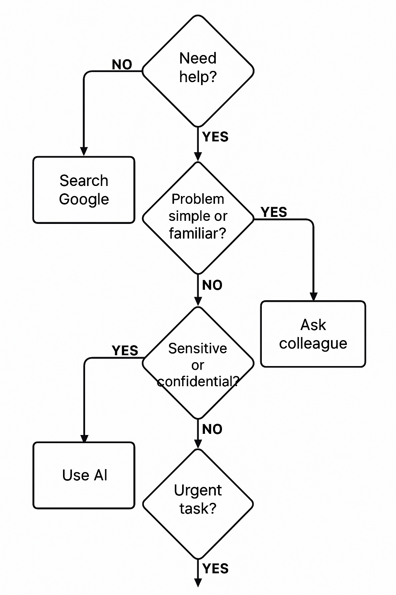

# Help-Seeking Strategy: AI, Google, or Colleagues?

## 🤖 When Do I Prefer Using AI (like ChatGPT)?

I find AI tools most helpful when:
- I need a **quick explanation** or **code snippet**.
- I want help understanding unfamiliar concepts (e.g., Git, regex, async functions).
- I'm prototyping and need **rapid feedback** or **edge case ideas**.
- I want to **brainstorm approaches** before implementation.

AI is great for getting unblocked fast and simulating a pair-programming partner — especially for solo work.

---

## 🔍 When Do I Prefer Using Google?

I turn to Google when:
- I need **official documentation** (like MDN, React docs, etc.).
- I’m looking for **well-known issues** on Stack Overflow or GitHub.
- I want to **compare multiple perspectives** or solutions.

Google is best when you're researching **existing patterns**, libraries, or large community-verified answers.

---

## 🧑‍💻 When Do I Ask a Colleague?

I ask a teammate when:
- The issue involves **project-specific knowledge** (architecture, naming, internal logic).
- I’ve tried multiple strategies and want a **second opinion**.
- There’s a **time-sensitive bug** that could affect others.
- I need **consensus** on a solution direction or decision.

Colleagues bring **context** and understand the **codebase culture**, which AI and Google can’t.

---

## ⚠️ Challenges of Troubleshooting Alone

- **Overconfidence** in partial understanding (without realizing gaps).
- **Going down the wrong path** for too long.
- Feeling isolated or frustrated, especially under pressure.
- Lack of feedback or blind spots — code may “work” but not be clean or maintainable.

This is why balancing self-help with collaboration is crucial.

---

## 📊 Flowchart Overview

See this flowchart  this repo for a visual guide on how I choose between help sources based on urgency, complexity, and context.

