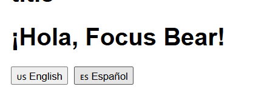

# i18n.md

## What I did (files + tasks)

1) **Research how i18next works in React and why internationalization matters**
   - Notes captured in this doc (sections below: “Why use i18next…” and “Dynamic content”).
   - Key ideas used in code: centralized resources, interpolation (`{{name}}`), pluralization (`_plural`), and language switching via `i18n.changeLanguage`.

2) **Set up i18next in a React project**
   - **File:** `src/i18n.js`  
     - Initialized i18next with `initReactI18next`.
     - Inlined resources (no backend needed) and disabled Suspense to simplify setup.

3) **Create translations for two languages (English & Spanish)**
   - **File:** `src/i18n.js`  
     - Added keys in both `en.translation` and `es.translation`:  
       `title`, `welcome`, `description`, `item_count` + `item_count_plural`,  
       `change_language`, `helloName`, `formTitle`, `nameLabel`, `emailLabel`, `submit`, `apiResponse`.

4) **Use `useTranslation` to display translated messages**
   - **File:** `src/index.js` — `import './i18n'` **before** rendering to ensure the instance is ready.
   - **File:** `src/App.js` — imported `useTranslation`/`Trans`, used `t('...')` for all visible UI strings, and showed pluralization with `{ count }`.
   - **File:** `src/components/HelloWorld.jsx` — refactored to `t('helloName', { name })` (no hard-coded “Hello, Focus Bear!”).
   - **File:** `src/LanguageSwitcher.jsx` — calls `i18n.changeLanguage('en'|'es')` and uses `t('change_language')`.
   - (Optional UI using translations) **File:** `src/components/UserForm.jsx` — labels and button text use `t()`.

5) **Push i18next implementation to GitHub**
   - See “Git commands” section below.

---

## Challenges faced (and fixes)

- **Peer-dependency conflict (npm ERESOLVE)**  
  Latest `i18next@25.x` wanted TS ^5 while CRA5 used TS 4.9.5.  
  **Fix:** pinned versions to `i18next@22.5.1` and `react-i18next@12.3.1`.

- **Windows shell differences**  
  `rm -rf` failed in PowerShell.  
  **Fix:** used `Remove-Item -Recurse -Force node_modules, package-lock.json`.

- **Initialization order**  
  Components rendered before i18n, so `t()` returned raw keys (e.g., `title`).  
  **Fix:** `import './i18n'` at the top of `src/index.js` before `<App />`.

- **Missing/incorrect keys**  
  Headings showed `title`, `formTitle`, `apiResponse` literally.  
  **Fix:** added those keys to both languages in `src/i18n.js`, verified with `i18n.getResourceBundle`.

- **Hard-coded strings**  
  “Hello, Focus Bear!” didn’t switch languages.  
  **Fix:** changed `src/components/HelloWorld.jsx` to use `t('helloName', { name })`.

---

## Why use a library like i18next (vs manual strings)?
- **Language rules built-in:** plural/gender/context variations without ad-hoc logic.
- **Clean separation:** UI stays in components; text lives in translation resources.
- **Interpolation safety:** `{{name}}` is escaped correctly for React (no double-escaping).
- **Scales well:** namespaces, lazy loading, detectors, devtools, and strong ecosystem.

---

## Handling dynamic content (UGC) in a multilingual app
- **Don’t auto-translate stored UGC.** Keep original text; label the content’s language where possible.
- **Offer on-demand machine translation** for viewing (clearly marked), but don’t overwrite originals.
- **Localize surrounding UI + formatting** (dates/numbers/relative time) via i18next/Intl APIs.
- **Store `contentLang` metadata** to improve filtering/search and future features.
- **Sanitize & render safely.** Use `<Trans>` only for trusted markup—not arbitrary UGC.

---

## How to verify locally
1. `npm install` (or pin: `npm i --save-exact i18next@22.5.1 react-i18next@12.3.1`)
2. `npm start`
3. In the UI:
   - Confirm page shows translated headings (`title`, `formTitle`, `apiResponse`).
   - Click **English / Español** — all UI strings and “Hello, Focus Bear!” should switch instantly.
   - Check pluralization by changing the `itemCount` in `src/App.js`.

---

## Files changed
- `src/i18n.js` — i18next setup + EN/ES resources
- `src/index.js` — ensure i18n loads before render
- `src/App.js` — use `useTranslation`/`Trans` + pluralization
- `src/HelloWorld.js`- Imported hello world 
- `src/LanguageSwitcher.jsx` — change language buttons
- `src/components/HelloWorld.jsx` — translated greeting
- `src/components/UserForm.jsx` — translated labels and button (optional but included)

---

Evidence: Esponal (Spanish ) Translation

