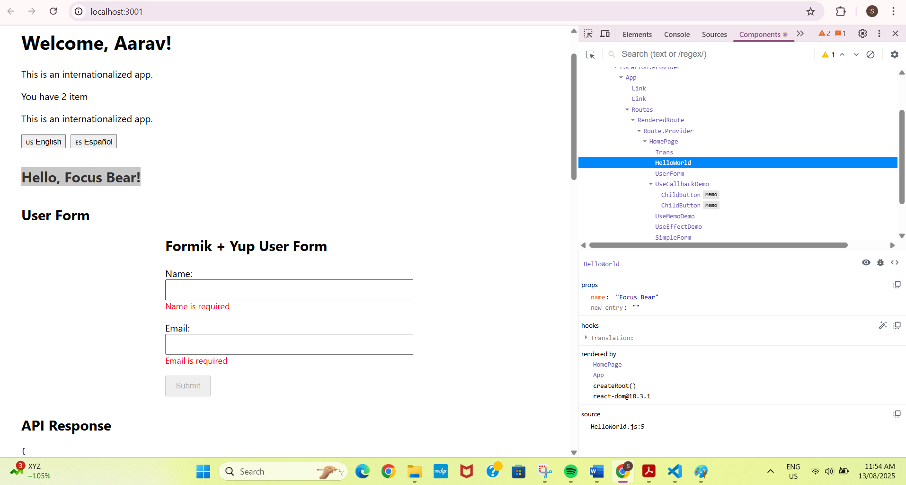
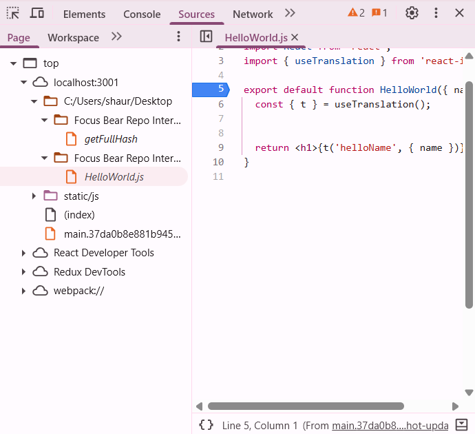

# React Debugging Techniques

## 🔍 Most Common Debugging Techniques

- **Console Logging**  
  The go-to tool for quick checks. `console.log()` is handy to trace values, catch undefined variables, or verify function calls.

- **React DevTools**  
  Helps visualize the component tree, inspect props and state, and trace re-renders. It’s a must-have for any React developer.

- **Breakpoints in DevTools or VS Code**  
  Pausing execution in real-time using browser or VS Code breakpoints lets you inspect variable values step-by-step.

- **Using `debugger` Statements**  
  Inserting `debugger` into your code pauses it when DevTools are open, making it easy to inspect what's going wrong.

## Most Effective Debugging Tools

- **React Developer Tools (Chrome/Firefox Extension)**  
  Great for checking props/state, highlighting re-renders, and navigating deeply nested component trees.

- **Chrome/Firefox DevTools**  
  Essential for inspecting API calls, debugging JavaScript, and tracking layout/CSS issues.

- **VS Code Debugger**  
  Allows breakpoint debugging and stepping through code in the editor itself.

- **React Profiler (in DevTools)**  
  Use this to spot performance bottlenecks, identify unnecessary re-renders, and optimize render timing.

- **Third-party tools**:  
  - **Sentry** for runtime error tracking  
  - **Redux DevTools** (if using Redux) for tracking state changes over time  
  - **ESLint** and **TypeScript** for static code analysis

## ⚙️ Debugging in Large React Codebases

- **Break it Down**: Reproduce the bug in isolation by working in smaller components or simplified test cases.
- **Use Error Boundaries**: Catch runtime errors in part of the UI and prevent the entire app from crashing.
- **Modular Architecture**: Stick to a clean file and folder structure to quickly find and isolate code.
- **Write Unit Tests**: Use Jest and React Testing Library to catch regressions before they become bugs.
- **Add Logging Services**: Tools like Sentry or LogRocket can show real-time errors and stack traces in production.
- **Track Component Lifecycles**: With hooks like `useEffect`, you can trace what happens and when.

## Pro Tips

- Always keep **React DevTools** open while working—spotting unnecessary renders early saves headaches later.
- Don’t ignore **warnings in the console**. They're there for a reason!
- Use **component names and prop types wisely**—it makes debugging so much easier in the long run.

Evidence:

Screenshot – Inspecting Component Props in React DevTools
Below is a screenshot of me using React DevTools (Components tab) to inspect the HelloWorld component.
It shows the name prop value ("Focus Bear") passed from the parent, confirming that props are flowing correctly.

📍 Using Chrome DevTools Breakpoint (fastest option)

Chrome DevTools – Breakpoint in HelloWorld.js

This screenshot shows the Sources panel in Chrome DevTools with a breakpoint set at line 5 of HelloWorld.js.

The breakpoint is placed at the start of the HelloWorld function so execution will pause before the useTranslation() hook is called.

This allows me to inspect variables in the scope, step through the function, and verify that the name prop and translation function are working correctly.