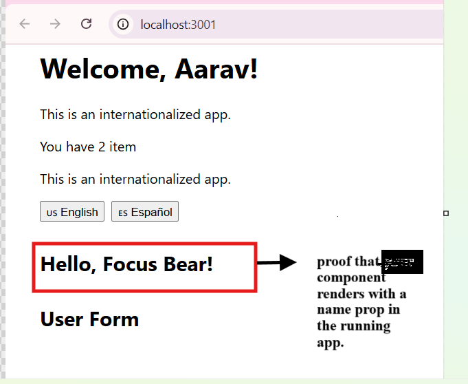
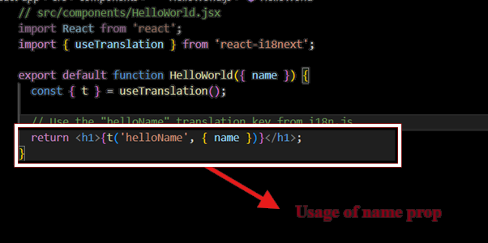
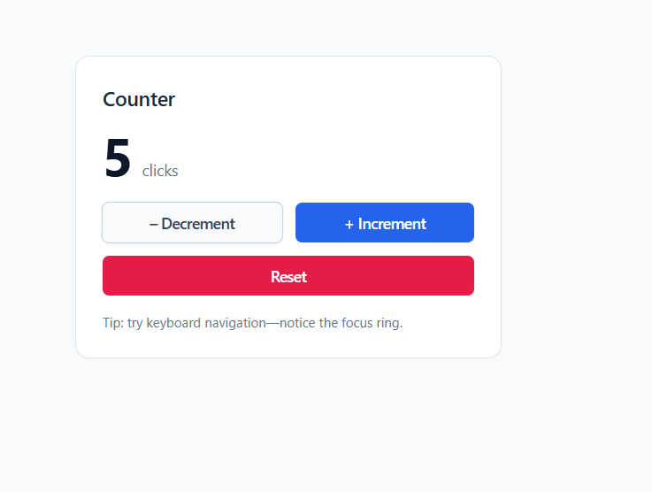

#Understanding Components & Props

### Reflection: Why are components important in React?

Components are important in React because they let you split your user interface into smaller, reusable parts. 

Instead of working with one big file, you can build your app from simple building blocks that each handle their own piece of the UI. This makes your code easier to understand, update, and reuse in different places. 

Overall, using components helps keep your project organized and makes it easier to build and maintain even as the app grows. 

NOTE: My application is in my-react-app folder.

 - Image showing my-react-app showing Hello Focus bear is rendered!!
(This is how it looks like)

This annotated code screenshot – showing { name } in use.
Commit id: 75fe81a5a83a13709face6a1451e95cbb7ea1ca7


# react_fundamentals.md — Tailwind Setup Reflection

## What challenges did I face during setup?
1. **Choosing the right React starter template**  
   - CRA works but is heavier; I chose Vite for faster builds and easier Tailwind setup.
2. **Configuring `tailwind.config.js` content paths**  
   - Initially forgot to include `./index.html` and `./src/**/*.{js,ts,jsx,tsx}`, so styles didn’t apply. Fixed by updating the content array.
3. **CSS entry point issues**  
   - Forgot to import `index.css` in `main.jsx`, so Tailwind utilities didn’t load. Added `import './index.css';` in the entry file.
4. **Validating Tailwind was actually running**  
   - Confirmed by creating a simple `bg-blue-50 text-4xl` heading and seeing changes in real time.

## Lessons Learned
- Always double-check Tailwind’s content configuration — missing paths = no styles.
- Import your Tailwind CSS file in the root JS/TS entry point.
- Test with visible, obvious classes to confirm Tailwind is active before deeper work.

## README Evidence
A **detailed `README.md`** with setup steps and screenshot evidence is located at:  

C:\Users\shaur\Desktop\Focus Bear Repo Intern\ssethx24-intern-repo-focusbear\README.md 


Screenshot showing Tailwind is working. Commit ID: ad196f6eb74c63eab235b6a3a88055c6868ccdc4 

Reflection – React Router Setup
Commit ID: 384c75f80fd3e6fdee13d3ce309e9bffaef7a0e9

Files Created / Modified
src/index.js –

Wrapped the <App /> component with <BrowserRouter> from react-router-dom to provide routing context.

This ensures that <Link> and <Routes> inside App.js work without errors.

src/App.js –

Added navigation links using <Link> from react-router-dom.

Added <Routes> with <Route> components for two pages: Home and Profile.

Integrated routing with your existing i18n, hooks demos (useCallback, useMemo, useEffect), and API demo.

src/pages/Home.js (new) –

Created a simple Home page component for routing demonstration.

src/pages/Profile.js (new) –

Created a simple Profile page component for routing demonstration.

What are the advantages of client-side routing?
Faster navigation –
Pages load instantly without a full server request; only the changed UI is rendered.

Smooth user experience –
No page refresh flicker, keeping state (like form inputs) intact between navigations.

Reduced server load –
Since navigation happens in the browser, the server doesn’t need to re-render the whole page on each route change.

More control over transitions & state –
You can manage animations, preserve component state, and fetch data only when necessary.

Single Page Application (SPA) benefits –
Allows building apps that feel like native applications with dynamic content updates.

screenshots for evidence:
Home page: 
Profile page: 

📄 Reflection — react_fundamentals.md
Commit ID: a0117c6aefa721871adae95d1cf422f1217949d4
Files in: my-react-app folder

Topic: Common issues when working with lists in React
When working with lists in React, some common issues include:

Missing or duplicate keys

Every element in a list needs a unique key prop so React can efficiently track changes.

Using array indexes as keys can cause problems when the list changes order or items are added/removed.

Unnecessary re-renders

If list items re-render even when data hasn’t changed, performance can drop, especially with large lists.

This can be avoided by memoizing components or ensuring stable references.

Mutating state directly

Directly modifying the array in state (e.g., array.push()) won’t trigger a re-render.

Instead, always create a new array (e.g., [...array, newItem]) before setting state.

Performance with large lists

Large lists can slow rendering; techniques like virtualization (react-window, react-virtualized) help.

Controlled vs uncontrolled inputs in lists

When a list contains input fields, keeping their state in sync can be tricky.

You need to manage controlled inputs properly to avoid React warnings.

✅ This reflection corresponds to the changes made in src/App.js and the newly added src/components/SimpleForm.js in commit a0117c6aefa721871adae95d1cf422f1217949d4.

Screenshot for evidence 


Question: What happens if we modify state directly instead of using setState?

Commit: 93ed58c7e59e1803e72d7f6af707b17b53a4b116
Files Changed:

src/components/Counter.js (modified to use useState instead of Redux as done in earlier task)

Question: What happens if we modify state directly instead of using setState?

Answer:
In React, state is immutable and should never be changed directly.
If we modify state directly (e.g., count++), React does not detect the change and will not re-render the component, leaving the UI stale and out of sync with the actual data.

The correct approach is to use the updater function returned by useState (e.g., setCount(prev => prev + 1)). This tells React that the state has changed and triggers a re-render with the new value.

Risks of modifying state directly:

No UI update since React didn’t detect a state change.

Possible stale or incorrect values due to React’s batching of updates.

Breaks the predictable state flow in React, making debugging harder.

### Example from Counter.js

I tested this in my `Counter.js`:

```jsx
const [count, setCount] = useState(0);

const incrementDirect = () => {
  count++;   // ❌ Direct modification
};
When I clicked the button, the console log showed count increasing,
but the UI (<p>Count: {count}</p>) did not update.

After switching to the correct method:

jsx
Copy code
setCount(prev => prev + 1); // ✅ Proper update
the UI updated immediately.


## Styling with Tailwind CSS — Counter & Button

### What I changed
- **Counter.js** now uses Tailwind utilities for layout and typography:
  - Page/container: `min-h-screen bg-slate-50 flex items-center justify-center p-6`
  - Card: `bg-white rounded-xl shadow-sm ring-1 ring-slate-200 p-6`
  - Title: `text-lg font-semibold text-slate-800`
  - Count row: `mt-3 flex items-baseline gap-2`
  - Count number: `text-5xl font-bold leading-none text-slate-900`
  - Buttons grid: `mt-5 grid grid-cols-2 gap-3`
- **Button component** (`src/components/Button.jsx`) with variants, sizes, and states:
  - **Base:** `inline-flex items-center justify-center rounded-md font-medium tracking-tight transition-transform duration-100 active:scale-95 transition-colors focus:outline-none focus-visible:outline-none focus-visible:ring-2 focus-visible:ring-offset-2 disabled:opacity-50 disabled:pointer-events-none`
  - **primary:** `bg-blue-600 text-white hover:bg-blue-700 active:bg-blue-800 focus-visible:ring-blue-600`
  - **secondary:** `bg-white text-slate-700 ring-1 ring-slate-300 hover:bg-slate-50 active:bg-slate-100 focus-visible:ring-slate-500`
  - **danger:** `bg-rose-600 text-white hover:bg-rose-700 active:bg-rose-800 focus-visible:ring-rose-600`
  - **Sizes:** `sm: text-sm px-3 py-1.5`, `md: text-sm px-3.5 py-2`, `lg: text-base px-4 py-2.5`
  - Accessibility: `focus-visible` ring + `ring-offset-2`; `active:scale-95` for press feedback.

**Commit ID(s):** `<REPLACE_WITH_YOUR_COMMIT_HASH>`

#Advantages of using Tailwind CSS

Rapid development – Style directly in JSX without switching to a CSS file.

Consistent design system – Built-in spacing, color, and typography scales ensure uniform styles.

Responsive & state styling inline – Easily add hover:, focus:, active:, sm:, md: directly on elements.

Smaller production bundle – JIT mode purges unused classes.

Centralized customization – All design tokens live in tailwind.config.js.

Potential pitfalls

Long, cluttered class strings – JSX can become hard to read without extracting components.

Learning curve – Remembering utility names and scales takes time.

Risk of style duplication – Repeating the same utility sets across files instead of abstracting.

Design drift – Ad-hoc colors or values can break consistency.

Build dependency – Requires Tailwind/PostCSS setup, which adds a build step.

Screenshot of component styled with tailwind css 

b6bc1ea102b994d16d06b5083ea35e491c588f88 commit id 
Counter styled with Tailwind + Button variants in action:  
