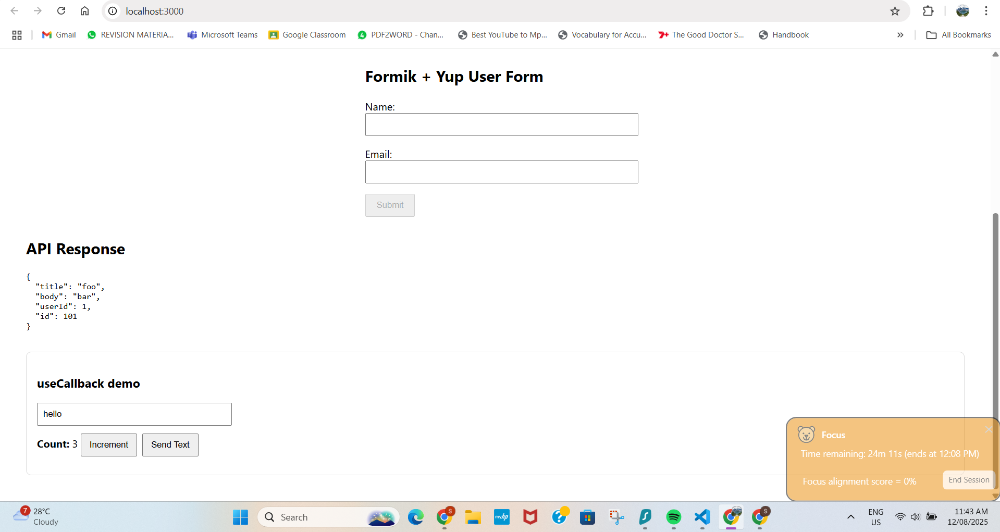
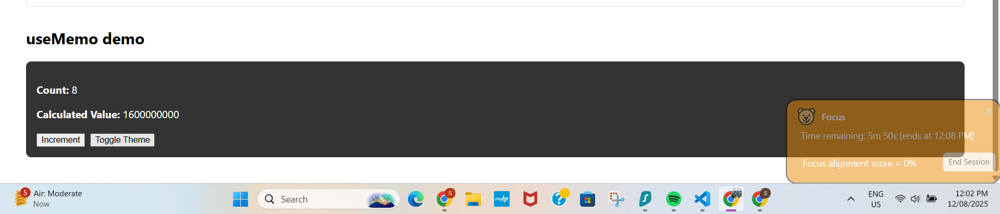

# react_hooks.md — useCallback

## What I built (files)- In my-react-app
- **`src/hooks-demo/UseCallbackDemo.jsx`** — Parent component that:
  - Holds `count` and `text` state.
  - Passes two functions as props to a child.
  - Uses **`useCallback`** to memoize those functions.
  - Contains a memoized child (`ChildButton`) in the same file via `React.memo` (so you can see when it re-renders).
- **`src/App.js`** — Renders `<UseCallbackDemo />` so it’s visible in the app.

> If you split the child out earlier: `src/hooks-demo/ChildButton.jsx` (memoized with `React.memo`).  
> In the current working setup, the child is defined **inside** `UseCallbackDemo.jsx` to avoid import/export issues.

---

## Research: how `useCallback` works & when to use it
- In React, functions are **new objects on every render**. Passing a fresh function to a memoized child (`React.memo`) will still trigger a re-render because the prop reference changed.
- `useCallback(fn, deps)` returns the **same function instance** between renders **until** one of the dependencies changes. That keeps prop references stable and prevents unnecessary re-renders of memoized children.
- Good for:
  - Expensive child components wrapped with `React.memo`
  - Stable function identities used in dependency arrays (e.g., event handlers, effects, custom hooks)

---

## What problem does `useCallback` solve?
It **stabilizes function identity** across renders so memoized children don’t re-render just because the parent created a new function object. This reduces wasted work.

---

## How does `useCallback` differ from `useMemo`?
- `useCallback(fn, deps)` → memoizes a **function** reference.
- `useMemo(factory, deps)` → memoizes a **computed value** (`factory()` result).
- Conceptually: `useCallback(fn, deps)` ≈ `useMemo(() => fn, deps)`, but `useCallback` is clearer when the thing you’re memoizing is a **callback** prop.

---

## When is `useCallback` not useful?
- When the function **isn’t** passed to memoized children or used in other memoized hooks—no re-render savings.
- When dependencies change **every render**—the function identity still changes, so memoization doesn’t help.
- For tiny components with trivial render cost—adds complexity without measurable benefit.

---

## How I verified with React DevTools
- **Console logs** in both parent and child:
  - Typing in the input updated `text` and re-rendered the parent.
  - Only the **child** whose prop depended on `text` re-rendered; the other child (receiving a `useCallback([])` handler) did **not**.
- **React DevTools** (Components/Profiler):
  - Confirmed only the relevant child re-renders when its callback’s dependencies change.
  - “Highlight updates” shows fewer updates with `useCallback`.

---

## Summary of the demo
- In `UseCallbackDemo.jsx`:
  - `increment` uses `useCallback([])` → stable identity; child with `onClick={increment}` won’t re-render on unrelated parent state changes.
  - `sendText` uses `useCallback([text])` → identity updates when `text` changes; its child re-renders appropriately.

Pls find ss attached for reference. 

Commit ID: 8717ddf92ff95a773ba60f7ce5e86fd868f83d5a 
-----

📄 Reflection – useMemo Hook
Commit ID: be5aa4434597199efd9eaa069f9d99f4f88b9a1a
Files added in this commit:

my-react-project/src/App.js — Integrated both UseCallbackDemo and UseMemoDemo into the main app.

my-react-project/src/hooks-demo/UseMemoDemo.js — Demonstrates expensive calculation optimized with useMemo.

1. How does useMemo improve performance?
useMemo stores (memoizes) the result of an expensive calculation and only recalculates it when its dependencies change.

In UseMemoDemo, the expensiveCalculation(count) function loops over a large range.
With useMemo, this loop only runs when count changes — so unrelated state updates like theme toggling don’t trigger the heavy computation.

2. When should you avoid using useMemo?
Avoid useMemo when:

The computation is fast and not resource-intensive.

Component re-renders infrequently.

The caching overhead outweighs the benefit.

The logic is simple and doesn't impact performance.

3. What happens if you remove useMemo?
Without useMemo:

The expensive calculation will run on every render — even when changes are unrelated to the computed value.

This increases CPU usage and slows down rendering.

The UI may feel less responsive if the calculation is complex.

Screenshot for evidence:
