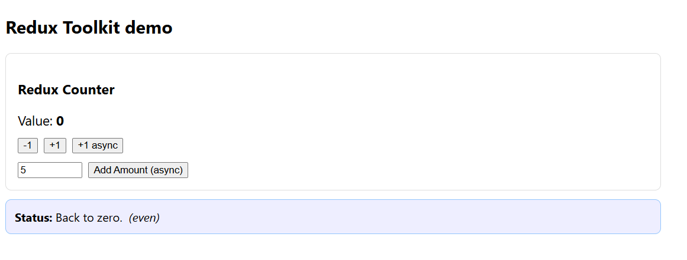

Reflection — Using Selectors in Redux
Commit ID: d281929b04b4210e57e34e40df5e6ca4ddd3f002
Files Created/Modified:

src/store/selectors.js — Created selector function selectCounterValue

src/components/Counter.js — Updated to use useSelector(selectCounterValue)

src/components/CounterMessage.js — New component using the same selector to display conditional messages

src/App.js — Integrated Counter and CounterMessage inside Home page

src/index.js — Wrapped <App /> with <Provider store={store}>

Task Summary:

Created a selector function to get the current counter value from Redux.

Used useSelector to access the counter value in multiple components (Counter and CounterMessage).

Modified the app to display different messages based on the counter value (e.g., "Keep going!" for odd numbers, "Back to zero." for zero, etc.).

Reflection Question:
What are the benefits of using selectors instead of directly accessing state?

Answer:
Selectors provide multiple benefits in Redux:

Encapsulation of State Structure – Components don’t need to know the exact shape of the Redux state. If state shape changes, only the selector needs updating, not every component.

Reusability – The same selector can be used in multiple components, ensuring consistent data access logic.

Testability – Selectors are pure functions, so they can be tested independently from components.

Performance Optimization – With memoized selectors (e.g., via Reselect), recalculations only happen when relevant parts of the state change, improving performance.

Readability – Improves code clarity by giving meaningful names to data retrieval logic.

Working Output Example:
This screenshot from my-react-app confirms correct functionality:

Explanation of Output:

Counter value is shown as 0.

Message correctly updates to "Back to zero. (even)" because the selector value is zero and even.

Counter increments/decrements both synchronously and asynchronously.

Message dynamically updates for odd/even values and zero.