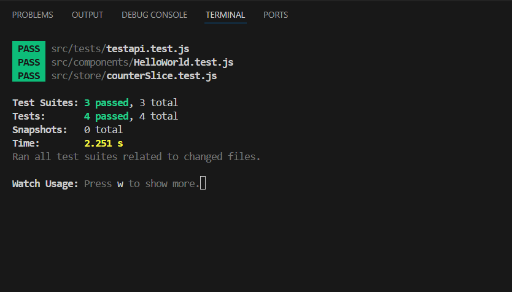

# Unit Testing Reflection

## ✅ What was the most challenging part of testing Redux?

The most difficult issue was **importing action creators correctly** from the Redux slice file counter.js.


Fig: Counter.js file

I initially faced this error:


It happened because I incorrectly structured the exports from `counterSlice.js`. I had to fix my exports by making sure actions like `increment` and `decrement` were explicitly exported like this:
export const { increment, decrement } = counterSlice.actions;

I also faced some initial issues with test discovery (Jest saying “no tests found”) which helped me learn how to format and locate test files correctly.


## 🧪 How do Redux tests differ from React component tests?

Redux tests:
- Focus on state logic and reducer behavior
- Test how dispatched actions affect the global state
- Are fast, isolated, and don't require the DOM

React component tests:
- Test the visual output and rendered DOM
- Use tools like `@testing-library/react` to simulate user interaction
- Are great for verifying what the user sees

Redux tests validate logic. React tests validate UI.

---
## Where I Wrote My Tests and What They Covered
I wrote all my Redux-related tests in the file src/store/counterSlice.test.js.


In that file, I tested:

That the increment action increases the value in the state.

That the decrement action decreases the value.

That the asynchronous action incrementAsync correctly waits and then updates the state.

To test the async action, I used configureStore() from Redux Toolkit to dispatch the thunk and then verified the state after the promise resolved.

## 📦 Additional Tests (Beyond Redux)

Before working on Redux, I implemented two other important test types:

### ✅ Component Test
- **File:** `HelloWorld.test.js`
- **What it did:** Checked that a React component correctly rendered the text `Hello, Focus Bear!`.


### ✅ API Logic Test
- **File:** `testapi.test.js`
- **What it did:** Mocked an Axios POST request and tested that `testPostRequest()` correctly handled responses and errors.


These tests were valuable to:
- Confirm my testing environment was working
- Practice mocking, asserting DOM elements, and testing async code
- Prepare me for more advanced Redux testing

---

## ✅ Final Results
All test files passed successfully:

counterSlice.test.js for Redux logic and async thunk

HelloWorld.test.js for React component rendering

testapi.test.js for API function logic

I pushed all working test files to GitHub. The testing setup is now complete and working reliably.



# API Mocking and Async Testing – Reflection

## Files Created for This Test

- **src/api/getPost.js** – Axios-based API function that fetches a post
- **src/components/PostViewer.js** – React component that calls `getPost` and renders the post
- **src/components/PostViewer.test.js** – Jest test file that mocks the API and verifies UI behavior

##  Why is it important to mock API calls in tests?

Mocking API calls is crucial because:
- It avoids making real HTTP requests during tests
- It makes tests fast, consistent, and isolated from network issues
- It allows you to test different API responses (e.g., success, failure, empty)
- You can focus on the component's behavior — not the server

Mocking is essential for **unit tests**, which should only test **one unit of logic at a time**.

## ⚠️ Common Pitfalls When Testing Async Code

1. **Not awaiting or waiting properly** – can cause `act()` warnings or missed assertions
2. **Using `getByText()` when multiple matches exist** – leads to ambiguity errors
3. **Forgetting to import `@testing-library/jest-dom`** – causes `.toBeInTheDocument()` to fail
4. **Not using `jest.mock()` correctly for named exports**
5. **Testing before React state updates are complete**

I  resolved these issues by:
- Using `screen.findByRole()` for specificity
- Adding `import '@testing-library/jest-dom'`
- Properly mocking `getPost` with:
  ```js
  jest.mock('../api/getPost', () => ({
    getPost: jest.fn(),
  }));

✅ Test Result
All tests passed successfully using mocked API data(these are all previous tests except the new counterSlice.test.js)


# Testing React Components with Jest & React Testing Library

## 📁 Files Created
- `src/components/Greeting.js` – React component with heading and button
- `src/components/Greeting.test.js` – Test file with rendering + click simulation

## ✅ What are the benefits of using React Testing Library instead of testing implementation details?

- It focuses on what the **user sees and does**, not internal props or state.
- Tests are more robust and less likely to break on refactors.
- Encourages good practices like accessibility (`getByRole`) and semantic queries.

## ⚠️ What challenges did you encounter when simulating user interaction?

- Getting the import path right (`./Greeting`) — small typos or case mismatches caused import failures.
- Forgetting `@testing-library/jest-dom` led to `.toBeInTheDocument()` errors.
- Choosing the right queries (`getByRole` vs `getByText`) helped avoid duplicate match errors.

Once those were fixed, testing UI interactions became simple and intuitive!

## ✅ Final Result

All tests passed — component behavior and interactivity were verified with confidence.


(these are all previous tests except the new Greeting.test.js)