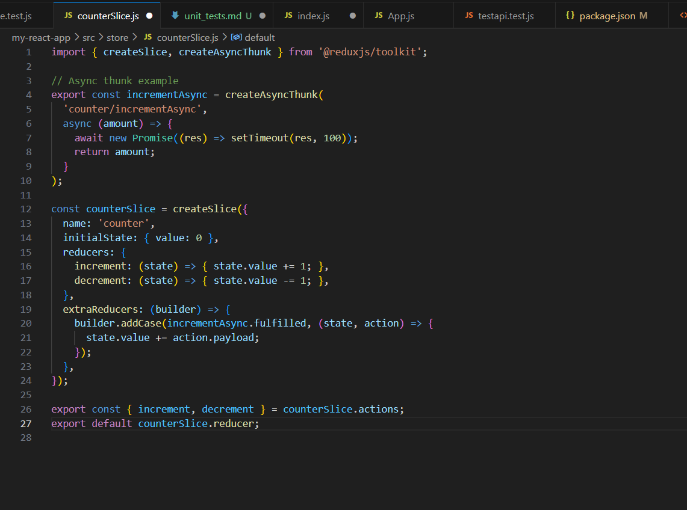

# Unit Testing Reflection

## ✅ What was the most challenging part of testing Redux?

The most difficult issue was **importing action creators correctly** from the Redux slice file counter.js.

Fig: Counter.js file

I initially faced this error:

It happened because I incorrectly structured the exports from `counterSlice.js`. I had to fix my exports by making sure actions like `increment` and `decrement` were explicitly exported like this:
export const { increment, decrement } = counterSlice.actions;

I also faced some initial issues with test discovery (Jest saying “no tests found”) which helped me learn how to format and locate test files correctly.

## 🧪 How do Redux tests differ from React component tests?

Redux tests:
- Focus on state logic and reducer behavior
- Test how dispatched actions affect the global state
- Are fast, isolated, and don't require the DOM

React component tests:
- Test the visual output and rendered DOM
- Use tools like `@testing-library/react` to simulate user interaction
- Are great for verifying what the user sees

Redux tests validate logic. React tests validate UI.

---
## Where I Wrote My Tests and What They Covered
I wrote all my Redux-related tests in the file src/store/counterSlice.test.js.

In that file, I tested:

That the increment action increases the value in the state.

That the decrement action decreases the value.

That the asynchronous action incrementAsync correctly waits and then updates the state.

To test the async action, I used configureStore() from Redux Toolkit to dispatch the thunk and then verified the state after the promise resolved.

## 📦 Additional Tests (Beyond Redux)

Before working on Redux, I implemented two other important test types:

### ✅ Component Test
- **File:** `HelloWorld.test.js`
- **What it did:** Checked that a React component correctly rendered the text `Hello, Focus Bear!`.

### ✅ API Logic Test
- **File:** `testapi.test.js`
- **What it did:** Mocked an Axios POST request and tested that `testPostRequest()` correctly handled responses and errors.

These tests were valuable to:
- Confirm my testing environment was working
- Practice mocking, asserting DOM elements, and testing async code
- Prepare me for more advanced Redux testing

---

## ✅ Final Results
All test files passed successfully:

counterSlice.test.js for Redux logic and async thunk

HelloWorld.test.js for React component rendering

testapi.test.js for API function logic

I pushed all working test files to GitHub. The testing setup is now complete and working reliably.

